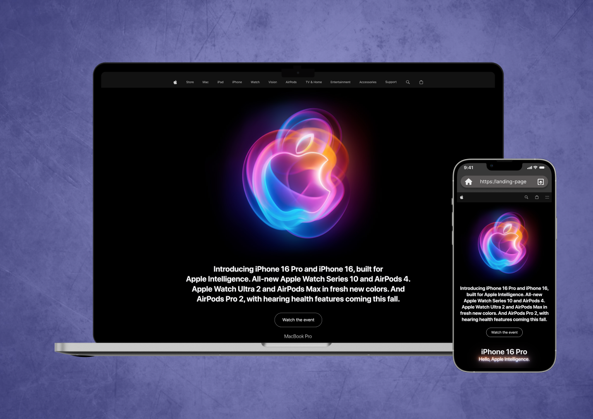

# Copy The "Apple" Site
Create a clone of the Apple website with its functionality using React.js. Implement modern components, interactive features, and responsive design, replicating the user interface and experience on the React platform.

➼ Technology Stack:
- React.Js for functional and structure
- SCSS/Sass (modules) for advanced styling and better maintainability
- JavaScript for dynamic functionality
- Flexbox & Grid for responsive design

This project showcases adaptive web design and a global JavaScript functionality to ensure a seamless user experience across all devices and screen sizes.